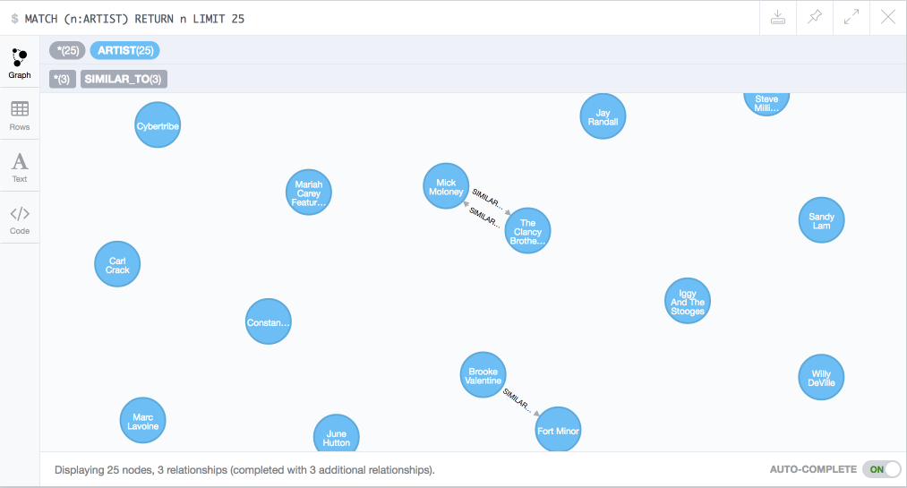

# eksploracja-danych-2016

## Temat: Analiza danych – Million song dataset - http://labrosa.ee.columbia.edu/millionsong/

## Lab 1

### Dostępne dane

Lista pól: http://labrosa.ee.columbia.edu/millionsong/pages/field-list

Dokumentacja echonest zwraca 503 - http://developer.echonest.com/docs/v4/_static/AnalyzeDocumentation_2.2.pdf ale udało się znaleźć wersję na webarchive. Przykładowo:

- https://web.archive.org/web/20111103131846/http://developer.echonest.com/docs/v4/_static/AnalyzeDocumentation_2.2.pdf
- https://web.archive.org/web/20160618002306/http://developer.echonest.com/docs/v4/artist.html

Jest dużo pól, które nie są opisane w API a które były generowanie "algorytmicznie" (przynajmniej w wersji z web archive) przykładowo `danceability`.

### Pomysły na zastosowania

- Wykorzystanie cech związanych z charakterystyką dzwięku utworu (bars, sections, segments, key, loudness) w algorytmach redukcji wymiarowości aby zobaczyć czy różne gatunki dzielą podobne cechy
- Hotttnesss vs familiarity
- Stworzenie sieci utworów/artystów na podstawie podobieństw utworów - sieć może posłużyć do weryfikacji tezy, że podobne gatunkowo
utwory lub wykonawcy tworzą podsieci, a także jako podstawa systemu rekomendacji
- Podobnie jak w pierwszym (redukcja wymiarowości utworów), aby zobaczyć "outliery" - piosenki o bardzo specyficznych cechach, a następnie analiza ich pod kątem gatunku, do którego należą lub czasu wydania
- analiza pod kątem artist latitude/longitude - czy artyści podobni gatunkowo znajdują się częściej blisko siebie czy dalej? być może jest to specyficzne tylko dla niektórych gatunków? czy można wyróżnić "Mekki" dla pewnych gatunków?
- title vs hotttnesss - czy ludziom bardziej podobają się piosenki o prostych tytułach? (być może również o prostym rytmie/tonacji?) - pewnie tak, więc raczej mało ciekawe
- przewidywanie popularności piosenki na podstawie jej podobieństwa do innego popularnego utworu

##### Notatki lab 2

- Schemat bazy + sposób na ściągniecie danych z N ostatnich lat, lub jednego artysty
- Zarejestrować / zapisać na projekt w zeusie

## Lab 2
- Ściąganie z ostatnich lat - nie udało się znaleźć - trzeba zciągnąć całość. Ew użyć [obrazu z AWS](https://aws.amazon.com/datasets/million-song-dataset/)
- Schemat bazy: 
- problemy z stworzeniem projektu:
 - https://drive.google.com/file/d/0BzT89FIsqfCWbFEyNTZlbGlydGs/view?usp=sharing
 - https://drive.google.com/file/d/0BzT89FIsqfCWMTFELXpLLTVWcTQ/view?usp=sharing

##### Notatki lab3

- przerzucić do trac'a

## Lab 3

- Sample wrzucony do neo4j 
- niestety tylko lokalnie
- Playlisty z API spotify https://developer.spotify.com/web-api/get-list-users-playlists/
