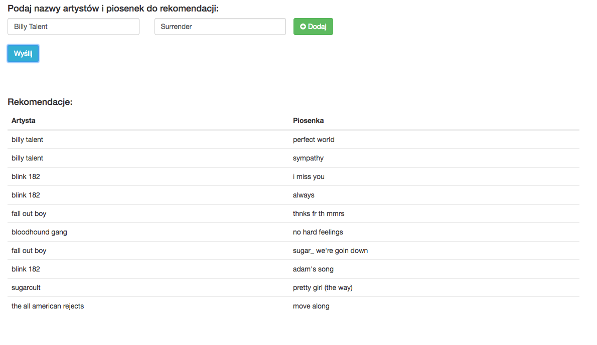
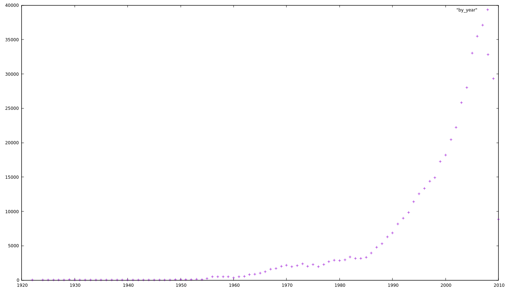

# Krzysztof Słonka, Dominik Rusiecki - System rekomendacji bazujący na Million Song Dataset

Zbiór danych Million Song Dataset to darmowy zbiór jednego miliona utworów muzyki
współczesnej wraz z cechami i danymi metadanymi.

## Co znajduje się w zbiorze danych?

W zbiorze znajdują się podstawowe informacje takie jak:
- Nazwa artysty
- Nazwa piosenki
- Nazwa albumu
- Rok wydania

Ale także i bardziej specyficzne informacje takie jak:
- taneczność (danceability)
- energia (energy)
- gorącość utworu (hotttnesss)

Pełny wykaz pól można znaleźć na stronie: http://labrosa.ee.columbia.edu/millionsong/pages/field-list

Zbiór danych może być wzbogacony przez inne zbiory między innymi:
- SecondHandSongs dataset - nower aranżacje piosenek (cover songs)
- musiXmatch dataset - teksty piosenek
- Last.fm dataset - etykiety i podobieństwa
- Taste Profile subset - dane użytkowników
- thisismyjam-to-MSD mapping - więcej danych użytkowników
- tagtraum genre annotations - etykiety gatunków
- Top MAGD dataset - więcej etykiet gatunków

## Skąd można pobrać zbiór?

Na stronie internetowej MSD jest odnośnik do pobrania podzbioru danych (1.8 GB) oraz informacja, że następujące uniwersytety: Drexel, Ithaca College, QMUL, NYU, UCSD, UPF powinny posiadać całą kopię.
Szybkie wyszukiwanie pokazało jednak, że zbiory te nie są publicznie dostępne na stronach tych uniwersytetów.

Wymieniony został także zasób AWS https://aws.amazon.com/datasets/million-song-dataset/ jednak korzystanie z niego wymaga uiszczenia opłaty w wysokości $0.10 za 1 GB-miesiąc.

Na szczęscie udało się znaleźć źródło nie wymienione na stronie MSD https://www.opensciencedatacloud.org/publicdata/million-song-dataset/ jednak prędkość transferu oraz ilość błędów w przesyłaniu znacząco spowolniła uzyskiwanie całości zbioru.

## Przygotowanie danych

Dane są przechowywane w formacie HDF5 co oznacza, że każdy utwór znajduje się w odddzielnym pliku binarnym.
W sieci znajduje się sporo krytyki na temat formatu HDF5, [tutaj](http://labrosa.ee.columbia.edu/millionsong/blog/11-3-9-hdf5-settling-argument) można przeczytać ostateczne oświadczenie na temat wyboru formatu przez MSD.

Aby odczytać ten format skorzystaliśmy z bibliteki python'owej h5py.
Po załadowaniu pliku można odwołać się do poszczególnych pól za pomocą zagnieżdżonego słownika. Przykłądowo aby uzyskać nazwę artysty:

```python
f['metadata']['songs']['artist_name'][0]
```

Więcej informacji:
- http://www.h5py.org/
- http://labrosa.ee.columbia.edu/millionsong/blog/11-3-9-hdf5-settling-argument
- https://support.hdfgroup.org/HDF5/whatishdf5.html

## Cel projektu

Wraz z prowadzącym przedmiot stwierdziliśmy, że ciekawym pomysłem byłaby próba stworzenia silnika rekomendacji który za pomocą relacji `SIMILAR_TO` wyszukiwałby podobne utwory, zliczał wagę podobności i proponował użytkownikowi piosenki które mają najwyższą sumę wag podobności.

Aby zweryfikować jakość rekomendacji systemu uzgodniliśmy, że wykorzystamy zbiór playlist AoTM http://labrosa.ee.columbia.edu/projects/musicsim/aotm.html który podzielimy na dwie części.
Jedna część zawierać będzie piosenki które przyjmiemy jako wejście do naszego algorytmu i na ich podstawie postaramy się przewidzieć drugą część listy.
Jeśli jakaś piosenka znajdzie się na przewidzianej części oznacza to, że z powodzeniem udało nam się przewidzieć piosenkę która podoba się użytkownikowi.

## Kowersja danych z hdf5 do bazy grafowej

Aby uzyskać prosty sposób wyszukiwania podobnych utworów, załadowaliśmy interesujące nas dane do grafowej bazy danych neo4j.
Przetworzenie 280GB jest zadaniem które wymaga sporo czasu i zasobów obliczeniowych więc zdecydowaliśmy się na skorzystanie z zasobów klastra obliczeniowego zeus.
Jednak po tygodniu wymieniania e-maili z https://helpdesk.plgrid.pl/#/ szybszą ścieżką okazało się przetworzenie danych na lokalnym komputerze.


## Struktura bazy danych

Baza składa się z wierzchołków z polami:
- Artysta
  - id (int)
  - imdb (string) - identyfikator z musicbrainz.org
  - id7digital (int) - identyfikator z 7digital.com albo -1
  - name (string)
- Tag
  - id (int)
  - tag (string)
- Album
  - id (int)
  - name (string)
- Piosenka
  - id (int)
  - title (string)
  - danceability (float)
  - duration (float) - seconds
  - energy (float)
  - loudness (float)
- Rok
  - id (int)
  - year (int)

Oraz z krawędzi:
- HAS_ALBUM
  - id (int)
- RELEASED_ON
  - id (int)
- HAS_TAG
  - id (int)
  - freq (float)
  - weight (float)
- SIMILAR_TO
  - id (int)
  - weight

Krawędzie są skierowane.

Wynikiem końcowym jest baza danych o następującym schemacie:


## Algorytm rekomendacji

Najważniejszą częścią algorytmu jest pętla licząca wagi podobności piosenek.
Jak widać z zapytania, wybieramy artystę który jest w relacji `:PERFORMS` z piosenką którą otrzymaliśmy jako wejście algorytmu i szukamy piosenki która połączona jest z pierwszą za pomocą relacji `:SIMILAR_TO`.
Następnie mając listę tych piosenek sortujemy ją po sumie wag.

```python
for song in song_list:
  res = session.run("MATCH (a2:ARTIST)-[:PERFORMS]->(n2:SONG)-[w:SIMILAR_TO]-(n:SONG)<-[:PERFORMS]-(a:ARTIST)  where lower(n.title)=\"" + song[1] +
      "\" and lower(a.name)=\"" + song[0] + "\" return n2.title AS title, a2.name AS name, w.weight as weight;")
  for r in res:
    similar[r["name"] + "\t" +  r["title"]] += r["weight"]


sorted_similar = sorted(similar.iteritems(),key=lambda (k,v): v, reverse=True)
```

Całość można zobaczyć w pliku `rec.py`

## Wyniki

Biorąc pod uwagę ogrom zbioru oraz różnorodność gustów i sposób w jaki użytkownicy wybierają swoje playlisty zadowalającym wynikiem jest dokładność silnika na poziomie kilku procent.

Wynik który otrzymaliśmy to: **0,12104283%**.

Jest on trochę niższy od oczekiwanego, wynika to głównie z faktu iż rekomendowanie konkretnych piosenek jest bardzo trudne.
Wpływ może mieć także występowanie literówek i brak ujednolicenia autorów w zbiorach (przykładowo jeśli dwóch artystów wykonywało jeden utwór może być on przedstawiony na dwa różne sposoby w zbiorach danych).

Dodatkowo stworzyliśmy interface graficzny który na podstawie podanych piosenek pokazuje 10 rekomendowanych utworów.



Demo aplikacji web-owej prezentuje conajmniej zadowalający poziom rekomendacji, wyświetlając piosenki które odpowiadały gustom deweloperów.

### Dodatkowe ciekawe charakterystyki

Piosenka która jest podobna do największej ilości piosenek:

```
MATCH (n1)-[r1:PERFORMS]->(n)-[r:SIMILAR_TO]->(x) RETURN n, n1, COUNT(r) ORDER BY COUNT(r) DESC LIMIT 10
```

1. Frankie Avalon - Venus - 658
1. The platters - The Great Pretender - 654
1. Bobby Freeman - Do you wanna dance? - 644

Liczba utworów wg roku



Najczęstsze tytuły utworów

Intro			1442
Untitled		393
Outro			326
Interlude		280
Home			227
Silent Night	203
Time			201
Hold On			187
Tonight			170
Smile			167

Artyści z największą liczbą utworów

Pennywise	313
Tina Turner	277
Bill & Gloria Gaither	264
Simon Harris	220
Bobby Darin	208
Magnatune Compilation	197
Blue Sky Boys	189
Beastie Boys	185
Melanie C	183
John Mayall & The Bluesbreakers / Eric Clapton	181

Artyści z największą liczbą albumów

Frankie Laine	94
Big Bill Broonzy	93
Tina Turner	93
Elvis Presley & Carrie Underwood	87
Ustad Nusrat Fateh Ali Khan	87
Duke Ellington & His Famous Orchestra	82
Dean Martin	81
Sonny Rollins with the Modern Jazz Quartet	81
Dave Brubeck	81
Jean Lumière	80

Najgłośniejsi artyści

Kylie Minoise	29.540000200271606
Massimo	13.567999839782715
Autotrash	11.74399995803833
Venetian Snares + Speedranch	10.110000103712082
Negative Network	8.440999984741211
Dj Balli	7.043000221252441
Prurient	6.3440001010894775
Boy + Girl	6.141999959945679
The Mike Korzak Band	5.664000034332275
Wavves	5.648000061511993

Statystyki długości

Średnia 249.1466157509036
Minimalna	0.31302
Maksymalna	3034.9058
Odchylenie standardowe	125.30470841274028
